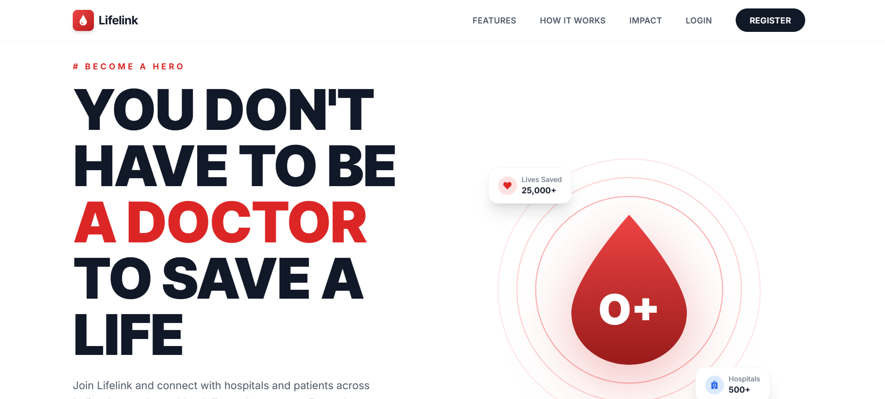
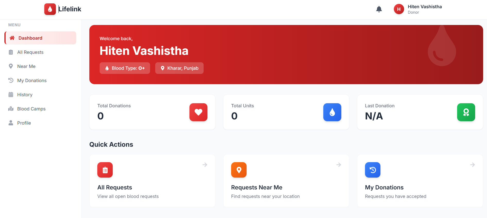
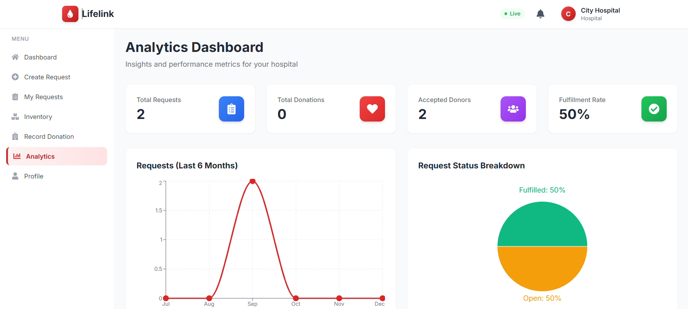
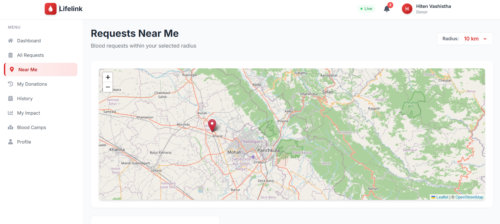
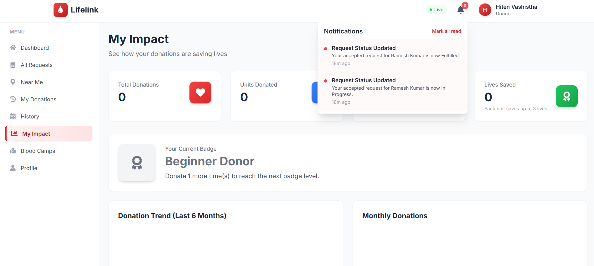

<div align="center">

# 🩸 Lifelink

### Connecting Blood Donors with Hospitals Across India

A full-stack MERN platform that connects blood donors with hospitals and patients in real time.

[](https://lifelink-client-three.vercel.app)
[](https://github.com/hitenvashistha-cloud/lifelink)


</div>

---

## 🎯 Overview

**Lifelink** is a real-time blood donation management system designed to solve the critical problem of blood shortages in India. The platform connects:

- **Donors** who want to donate blood
- **Hospitals** who need blood urgently
- **Admins** who manage the platform

Every year, thousands of lives are lost due to the unavailability of blood at the right time. Lifelink bridges this gap with real-time notifications, location-based donor matching, and a modern user experience.

---

## 🌐 Live Demo

**Frontend:** [https://lifelink-client-three.vercel.app](https://lifelink-client-three.vercel.app)

**Backend API:** [https://lifelink-server-soug.onrender.com](https://lifelink-server-soug.onrender.com)

### Demo Credentials

| Role | Email | Password |
|------|-------|----------|
| **Admin** | admin@lifelink.com | admin123 |
| **Hospital** | hospital1@demo.com | demo123 |
| **Donor** | donor1@demo.com | demo123 |

> ⚠️ **Note:** The backend runs on Render's free tier, which spins down after 15 minutes of inactivity. The first request may take 30-50 seconds to wake up.

---

## ✨ Features

### 🔐 Authentication & Security
- JWT-based authentication with role-based access control
- OTP verification for registration and password reset
- Bcrypt password hashing
- Rate limiting and input sanitization
- Protected routes for each user role

### 🏥 Hospital Features
- Create emergency blood requests
- Real-time notifications when donors accept
- Manage blood inventory by type
- Record completed donations
- View analytics dashboard with charts
- Profile management with location picker

### 🩸 Donor Features
- View all open blood requests
- Location-based request search with interactive map
- Accept requests and share contact with hospitals
- Track personal donation history and impact
- View and register for blood donation camps
- Badge system based on donation count

### 👨‍💼 Admin Features
- Approve hospital registrations
- Manage all users with role filters
- Create and manage blood donation camps
- Platform-wide analytics and growth metrics
- View all requests and inventory data

### ⚡ Real-Time Capabilities
- Socket.io integration for live updates
- Instant notifications without page refresh
- Real-time request broadcasts to nearby donors
- Live donation status updates

### 🎨 UI/UX
- Modern animated landing page
- Scroll reveal animations and typewriter effects
- Sticky navbar with role-based navigation
- Toast notifications instead of alerts
- Skeleton loaders and loading states
- Fully responsive (mobile, tablet, desktop)

---

## 🛠️ Tech Stack

### Frontend
| Technology | Purpose |
|------------|---------|
| React 18 | UI library |
| Vite | Build tool |
| React Router v6 | Client-side routing |
| Tailwind CSS | Styling |
| Recharts | Analytics charts |
| Leaflet + React-Leaflet | Interactive maps |
| Socket.io Client | Real-time communication |
| Axios | HTTP client |

### Backend
| Technology | Purpose |
|------------|---------|
| Node.js | Runtime |
| Express.js | Web framework |
| MongoDB + Mongoose | Database |
| Socket.io | Real-time server |
| JWT | Authentication |
| Bcrypt.js | Password hashing |
| Express Rate Limit | API protection |
| Helmet | Security headers |

### DevOps
| Technology | Purpose |
|------------|---------|
| Vercel | Frontend hosting |
| Render | Backend hosting |
| MongoDB Atlas | Cloud database |
| GitHub | Version control |

---

## 🏗️ Architecture

```
┌─────────────────┐         ┌──────────────────┐         ┌─────────────────┐
│                 │         │                  │         │                 │
│   React App     │◄───────►│  Express API     │◄───────►│  MongoDB Atlas  │
│   (Vercel)      │  HTTP   │  (Render)        │  ODM    │  (Cloud)        │
│                 │         │                  │         │                 │
└────────┬────────┘         └────────┬─────────┘         └─────────────────┘
         │                           │
         │     Socket.io             │
         └───────────────────────────┘
              Real-time Events
```

---

## 📁 Project Structure

```
lifelink/
├── client/                     # React frontend
│   ├── src/
│   │   ├── components/         # Reusable UI components
│   │   │   ├── common/         # Card, Button, Badge, Loader, etc.
│   │   │   ├── Navbar.jsx
│   │   │   ├── Sidebar.jsx
│   │   │   ├── Footer.jsx
│   │   │   ├── MapView.jsx
│   │   │   └── LocationPicker.jsx
│   │   ├── context/            # React Context (Auth, Socket, Toast)
│   │   ├── hooks/              # Custom hooks
│   │   ├── layouts/            # Dashboard & Simple layouts
│   │   ├── pages/              # All pages
│   │   └── main.jsx
│   └── package.json
│
├── server/                     # Express backend
│   ├── src/
│   │   ├── config/             # Database, env config
│   │   ├── controllers/        # Business logic
│   │   ├── middleware/         # Auth, error handling
│   │   ├── models/             # Mongoose schemas
│   │   ├── routes/             # API routes
│   │   ├── services/           # Notification & OTP services
│   │   ├── socket/             # Socket.io setup
│   │   ├── app.js
│   │   └── server.js
│   └── package.json
│
└── README.md
```

---

## 🚀 Getting Started

### Prerequisites

- Node.js v18 or higher
- MongoDB Atlas account (or local MongoDB)
- Git

### Installation

**1. Clone the repository**

```bash
git clone https://github.com/hitenvashistha-cloud/lifelink.git
cd lifelink
```

**2. Install dependencies**

```bash
# Install backend dependencies
cd server
npm install

# Install frontend dependencies
cd ../client
npm install
```

**3. Set up environment variables**

Create `server/.env`:

```env
NODE_ENV=development
PORT=5000
MONGODB_URI=your_mongodb_atlas_connection_string
JWT_SECRET=your_super_secret_jwt_key
JWT_EXPIRES_IN=7d
CLIENT_URL=http://localhost:5173
```

Create `client/.env`:

```env
VITE_API_URL=http://localhost:5000
VITE_SOCKET_URL=http://localhost:5000
```

**4. Seed demo data (optional)**

```bash
cd server
npm run seed
```

This creates 200 donors, 20 hospitals, 150 requests, 300 donations, and 10 camps for testing.

**5. Start the servers**

Terminal 1 (backend):
```bash
cd server
npm run dev
```

Terminal 2 (frontend):
```bash
cd client
npm run dev
```

**6. Open the app**

Navigate to `http://localhost:5173`

---

## 🔌 API Endpoints

### Authentication
| Method | Endpoint | Description |
|--------|----------|-------------|
| POST | `/api/auth/register` | Register donor |
| POST | `/api/auth/register-hospital` | Register hospital |
| POST | `/api/auth/login` | Login user |
| POST | `/api/auth/generate-otp` | Send OTP |
| POST | `/api/auth/verify-otp` | Verify OTP |
| POST | `/api/auth/forgot-password` | Send reset OTP |
| POST | `/api/auth/reset-password` | Reset password |
| GET | `/api/auth/me` | Get current user |
| PUT | `/api/auth/update-profile` | Update profile |

### Requests
| Method | Endpoint | Description |
|--------|----------|-------------|
| POST | `/api/requests` | Create request (Hospital) |
| GET | `/api/requests` | Get all requests |
| GET | `/api/requests/nearby` | Get nearby requests (Donor) |
| PUT | `/api/requests/:id/accept` | Accept request (Donor) |
| PUT | `/api/requests/:id/status` | Update status (Hospital) |

### Other
| Method | Endpoint | Description |
|--------|----------|-------------|
| GET | `/api/inventory` | Get hospital inventory |
| POST | `/api/inventory` | Update inventory |
| GET | `/api/donations` | Get donations |
| GET | `/api/camps/upcoming` | Get upcoming camps |
| GET | `/api/notifications` | Get notifications |
| GET | `/api/analytics/hospital` | Hospital analytics |
| GET | `/api/analytics/admin` | Admin analytics |

---

## 📸 Screenshots

> Add screenshots to `docs/screenshots/` folder and reference them here.

### Landing Page


### Donor Dashboard


### Hospital Analytics


### Nearby Requests Map


### Real-Time Notifications


---

## 🎓 What This Project Demonstrates

- **Full-stack development** with MERN stack
- **Real-time communication** using Socket.io
- **Geospatial queries** with MongoDB 2dsphere indexes
- **Role-based authentication** and authorization
- **RESTful API design** with proper error handling
- **Modern React patterns** (Context API, custom hooks)
- **Responsive UI** with Tailwind CSS
- **Data visualization** with Recharts
- **Cloud deployment** on Vercel + Render
- **CI/CD** via GitHub integration

---

## 🔒 Security Features

- JWT-based session management
- Password hashing with bcrypt
- OTP verification for sensitive operations
- CORS with whitelisted origins
- Rate limiting on API endpoints
- Helmet for HTTP security headers
- MongoDB sanitization to prevent NoSQL injection
- Input validation on all forms

---

## 📈 Future Enhancements

- [ ] Real SMS OTP via DLT-registered provider
- [ ] In-app chat between hospitals and donors
- [ ] Push notifications via Firebase Cloud Messaging
- [ ] Progressive Web App (PWA) support
- [ ] Mobile app with React Native
- [ ] Blood donation eligibility countdown
- [ ] Rewards redemption store
- [ ] Multi-language support (Hindi + English)

---

## 🤝 Contributing

Contributions are welcome. Please follow these steps:

1. Fork the repository
2. Create a feature branch (`git checkout -b feature/AmazingFeature`)
3. Commit changes (`git commit -m 'Add some AmazingFeature'`)
4. Push to branch (`git push origin feature/AmazingFeature`)
5. Open a Pull Request

---

## 📄 License

This project is licensed under the MIT License. See the [LICENSE](LICENSE) file for details.

---

## 👨‍💻 Author

**Hiten Vashistha**

- GitHub: [@hitenvashistha-cloud](https://github.com/hitenvashistha-cloud)
- Email: hitenvashistha@gmail.com

---

<div align="center">

**If this project helped you, please give it a ⭐**

Made with ❤️ 

</div>